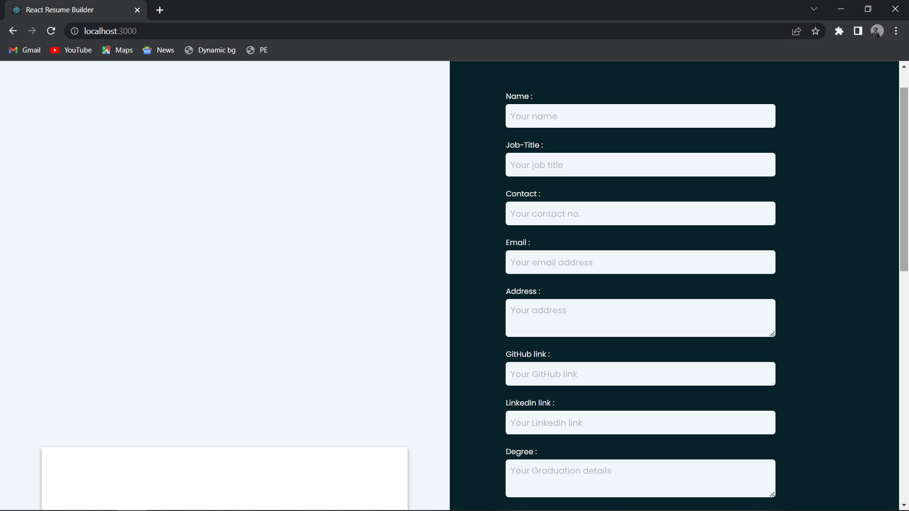
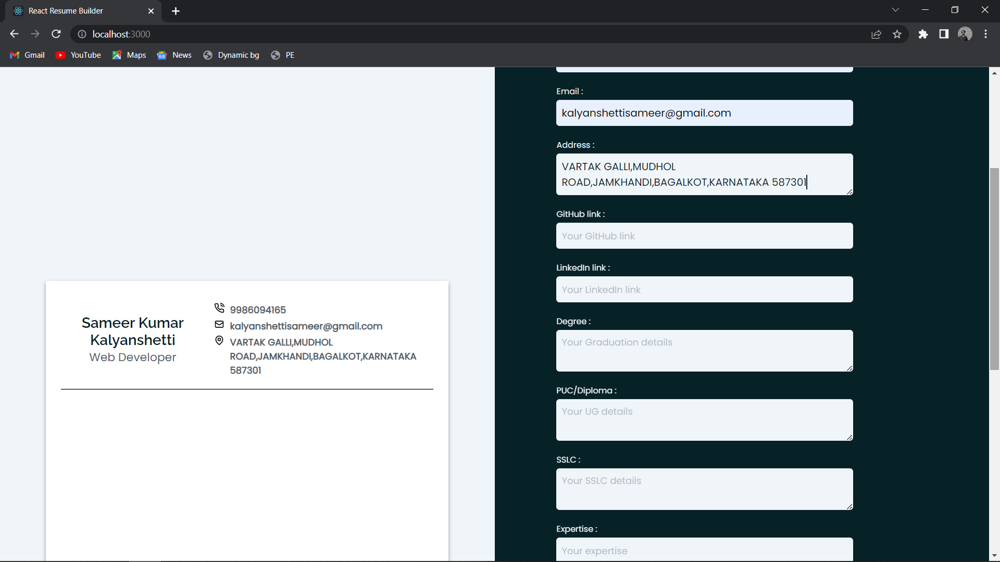
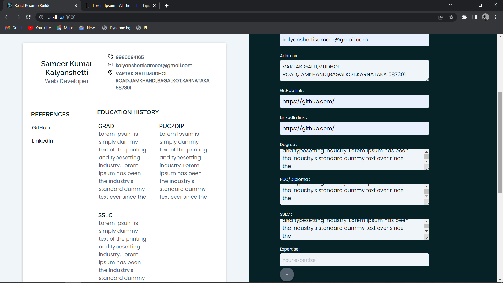
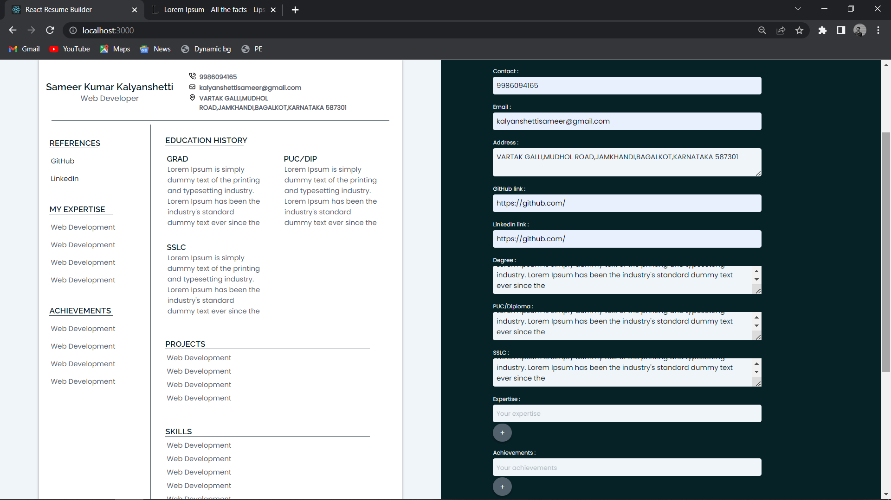
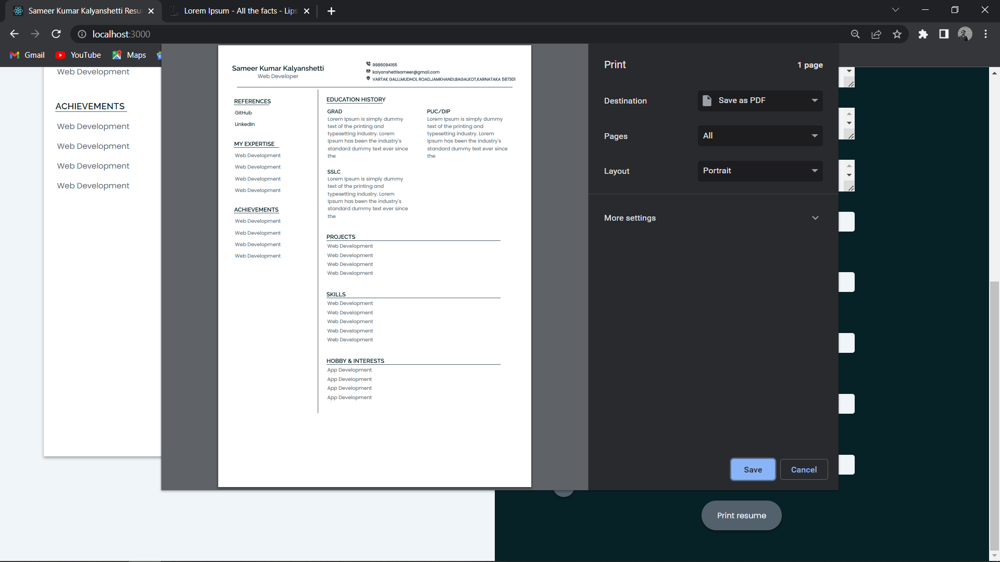
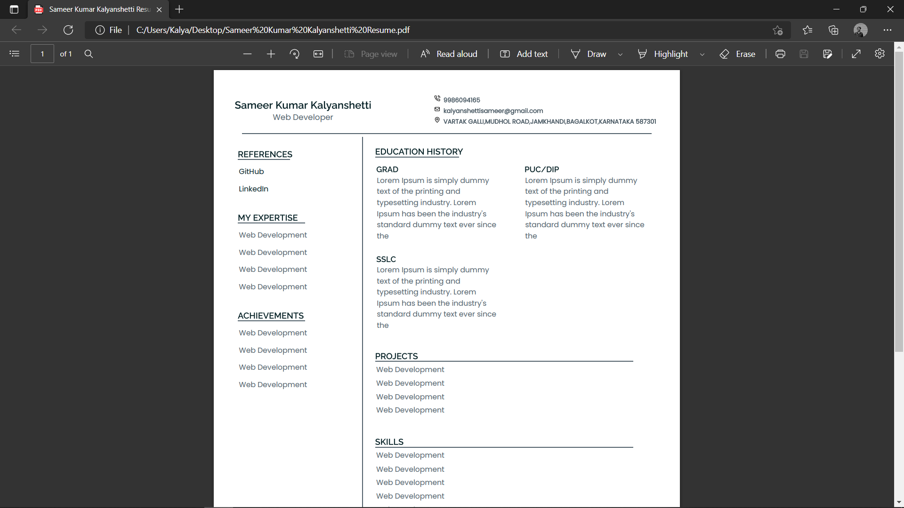

# Resume-Builder-Mern

## Resume-Builder is a MERN based application that allows users to create their resume with live preview and print it out or save it in pdf formate. And the pdf do contain clickable hyper-links like Github ,LinkedIn acc link. 

